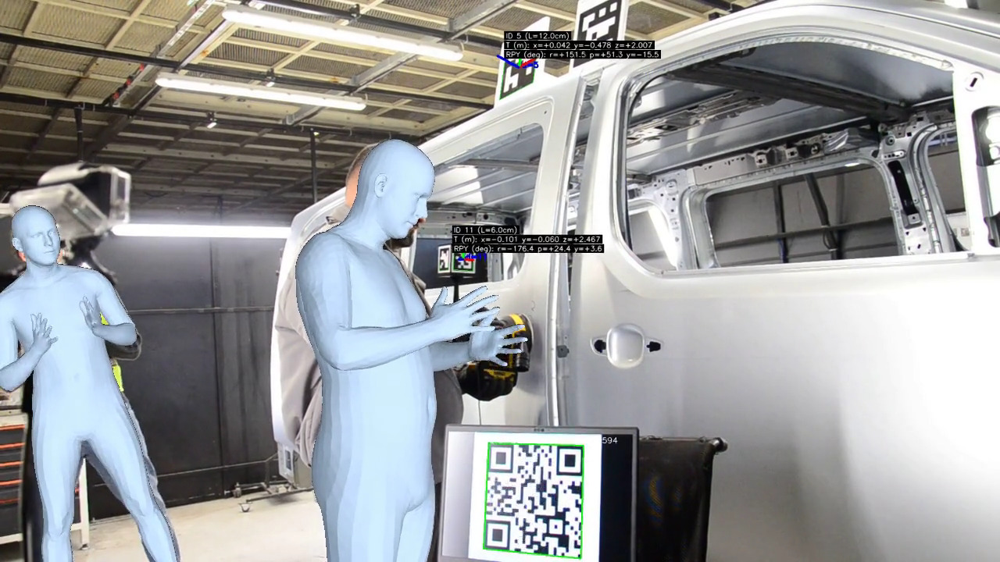
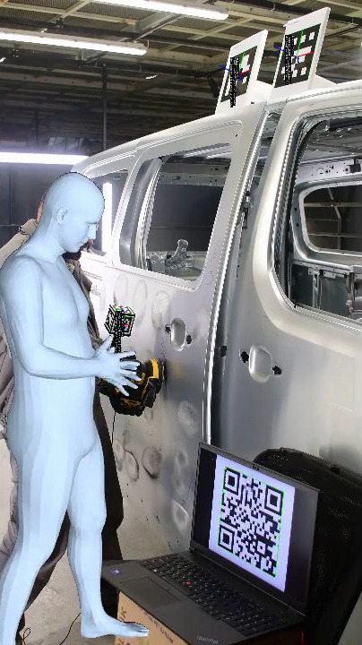
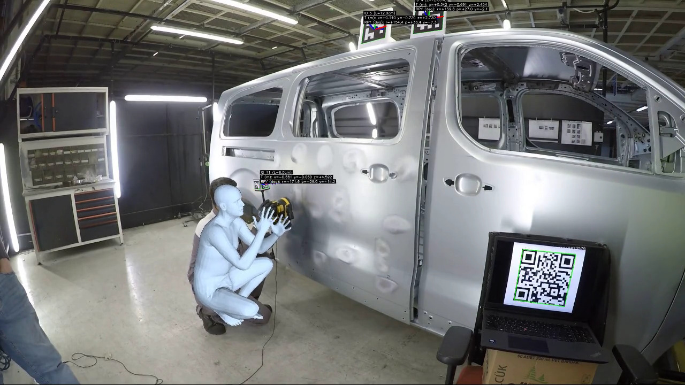
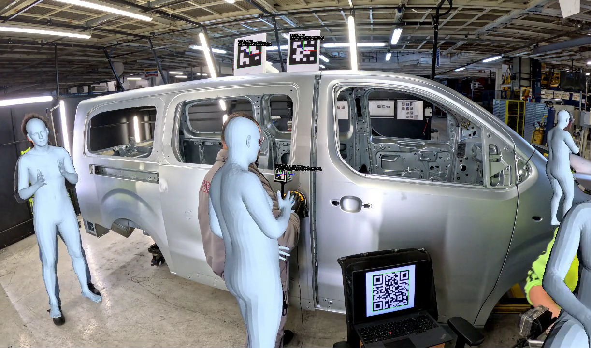
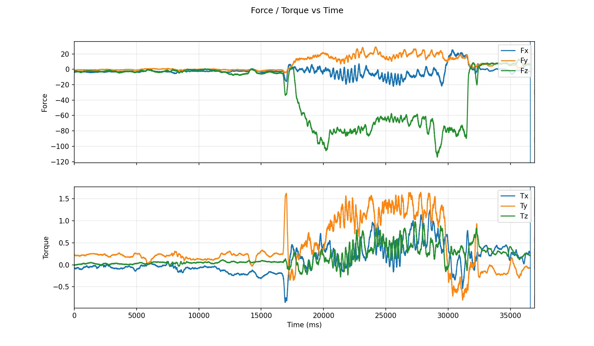

# MAGICIAN Tracking

Computer vision pipeline for real-time ArUco marker tracking, QR code timecode synchronization, and 3D pose visualization. Used in the MAGICIAN project for camera calibration and multi-modal sensor synchronization.

## Overview

This repository has two main components:

1. **Python Tracking** (`*.py`) -- Detects ArUco markers and QR codes in video streams, estimates 6DoF pose, exports wide-format CSV data, and renders annotated videos. Also provides 3D trajectory visualization from the CSV output.

2. **C Synchronization** (`synchronization/`) -- Displays fullscreen QR codes on a screen that encode live timestamps. Cameras recording the screen can decode these QR codes to achieve frame-accurate time synchronization across multiple sources.

## Example Results

The pipeline runs across heterogeneous camera setups. Each camera stream is time-synchronized using QR-code timecodes generated by [`synchronization/libQRSync.c`](synchronization/libQRSync.c) — a fullscreen X11 display that encodes a live Unix timestamp into a QR code at up to 60 Hz. Cameras pointing at the display decode these QR codes to achieve frame-accurate synchronization across all sources. ArUco marker 6DoF poses are then tracked in each synchronized stream and optionally overlaid with body pose estimation from [magician_body_pose_estimation](https://github.com/magician-project/magician_body_pose_estimation).

### NIKON D7000



### NIKON D7500



### GoPro Hero 4



### GoPro Hero 13



### ATI Force/Torque Sensor Recording

Force/torque measurements from an ATI sensor are recorded in parallel and aligned with the camera streams via the QR timecode synchronization, enabling multimodal learning-by-demonstration capture.



## Quick Start

```bash
# Install Python dependencies
./setup.sh

# Activate virtual environment
source venv/bin/activate

# Track ArUco markers from a video file with GoPro Hero 13 calibration
python3 tracker.py /path/to/video.mp4 --calib gopro13_5.3k.calib

# Track from a live camera (device 0)
python3 tracker.py 0 --calib gopro13_5.3k.calib --marker-lengths 1=0.06,13=0.06,42=0.06

# Generate printable ArUco markers
python3 aruco_printout.py
```

## Python Tracking Scripts

### `tracker.py` -- Main Tracker

All-in-one marker tracker that processes video frames, detects ArUco markers and QR codes, estimates 6DoF pose, and produces both an annotated video and a CSV file.

**Features:**
- ArUco marker detection with configurable dictionary and per-marker physical sizes
- QR code detection with key-value payload parsing (used for time synchronization)
- Optional chessboard detection with PnP pose estimation
- Camera calibration via Stereolabs `.calib` files (auto-scales intrinsics to video resolution)
- Optional undistortion/rectification before detection
- Exports a "wide" CSV with one row per frame and columns for each detected marker/QR
- Renders annotated frames as an MP4 video via ffmpeg

**Usage:**

```bash
python3 tracker.py <video_source> [options]
```

`<video_source>` is a video file path or a camera index (e.g., `0`).

**Options:**

| Option | Default | Description |
|---|---|---|
| `--calib <file>` | (none) | Stereolabs/Matlab `.calib` file for rectification |
| `--rectify-alpha <float>` | `1.0` | Rectification alpha (1.0 = keep full FOV, 0.0 = crop tightly) |
| `--output-video <name>` | `livelastRun3DHiRes.mp4` | Output video filename |
| `--save-video` / `--no-save-video` | save on | Toggle annotated video output |
| `--frame-prefix` | `colorFrame` | Prefix for intermediate frame dumps |
| `--image-ext` | `jpg` | Frame image extension |
| `--max-failures <int>` | `30` | Max consecutive failed frame reads before stopping |
| `--aruco-dict <name>` | `DICT_6X6_250` | OpenCV ArUco dictionary constant name |
| `--marker-lengths <id=len,...>` | (none) | Per-marker physical side length in meters, e.g., `1=0.06,3=0.12` |
| `--default-marker-length <float>` | `0.05` | Default marker side length in meters |
| `--generate-markers <id,id,...>` | (none) | Generate ArUco marker PNGs for the given IDs |
| `--marker-img-size <int>` | `200` | Generated marker image size in pixels |
| `--marker-out-dir <dir>` | `.` | Directory for generated marker PNGs |
| `--track-chessboard` | off | Enable chessboard detection + pose tracking |
| `--cb-w <int>` | `9` | Chessboard inner corners (columns) |
| `--cb-h <int>` | `6` | Chessboard inner corners (rows) |
| `--cb-square <float>` | `0.024` | Chessboard square size in meters |
| `--cb-sb` | off | Use `findChessboardCornersSB` (more robust, slower) |

**CSV Output Format:**

The CSV uses a "wide" format where columns are sized to the maximum number of markers seen in any single frame:

```
frame_id,aruco_0_id,aruco_0_tvec_x_m,aruco_0_tvec_y_m,aruco_0_tvec_z_m,aruco_0_roll_deg,aruco_0_pitch_deg,aruco_0_yaw_deg,qr_0_raw,qr_0_t_perf_ms,qr_0_t_unix_ms,qr_0_frame,qr_0_hz
```

### `plot_csv.py` -- 3D Trajectory Visualization

Reads a CSV file produced by `aruco.py` and renders an animated 3D plot of marker trajectories with axis triads (RGB quivers for orientation).

**Usage:**

```bash
python3 plot_csv.py <csv_path> [options]
```

**Options:**

| Option | Default | Description |
|---|---|---|
| `--fps <float>` | `30.0` | Playback frame rate |
| `--every <int>` | `1` | Sample every Nth row |
| `--axis_len <float>` | `1.0` | Length of axis triad quivers |
| `--trail <int>` | `60` | Number of trail frames to draw (0 = disable) |
| `--save_mp4 <path>` | (none) | Save output as MP4 |
| `--save_gif <path>` | (none) | Save output as GIF |
| `--headless` | off | Render without GUI (for servers/CI) |
| `--width <int>` | `1280` | Output width in pixels |
| `--height <int>` | `720` | Output height in pixels |
| `--dpi <int>` | `100` | Figure DPI |

**Example:**

```bash
# Interactive 3D plot
python3 plot_csv.py mark.csv

# Headless MP4 export
python3 plot_csv.py mark.csv --headless --save_mp4 mark-plot.mp4
```

### `aruco_printout.py` -- Printable Marker PDF

Generates ArUco marker images and assembles them into a printable A4 PDF at multiple sizes.

**Output:**
- Page 1: All markers in a compact ~6 cm grid
- Pages 2-N: Each marker at intermediate sizes (8, 10, 12, 14, 16 cm)
- Final pages: Each marker at maximum A4 size

Markers are generated at 2400px resolution for crisp printing. The PDF uses ReportLab.

**Example:**

```bash
python3 aruco_printout.py
# Output: aruco_print_sizes_A4.pdf
```

Edit the script to change marker IDs (default: 10-15) and dictionary (default: `DICT_6X6_250`).

### `tracker_from_directory.py` -- Batch PNM Processor

Processes `.pnm` image files from a directory for ArUco marker detection. Writes annotated output as `*_out.pnm` files. Uses hardcoded approximate camera intrinsics.

### Shell Scripts

#### `setup.sh` -- Environment Setup

Creates a Python 3 virtual environment and installs dependencies (`opencv-contrib-python`, `reportlab`).

```bash
./setup.sh
source venv/bin/activate
```

#### `tracker_dir.sh` -- Batch Video Processing

Runs `tracker.py` on every video file in a directory recursively.

```bash
./tracker_dir.sh <directory> <extension>
# Example:
./tracker_dir.sh /path/to/videos mp4
```

Processes each file with predefined marker lengths (IDs 4, 5, 10-15).

#### `plot_dir.sh` -- Batch 3D Plotting

Runs `plot_csv.py` on every `.csv` file in a directory. Exports headless MP4 plots.

```bash
./plot_dir.sh <directory>
# Example:
./plot_dir.sh /path/to/csv_files/
```

### Calibration Files

Two camera calibration files are included in the Stereolabs/Matlab-compatible `.calib` format:

| File | Camera | Resolution |
|---|---|---|
| `gopro13_5.3k.calib` | GoPro Hero 13 | 5312x2988 |
| `gopro4_2.7k.calib` | GoPro Hero 4 | 2704x1520 |

These contain intrinsic matrices (fx, fy, cx, cy) and distortion coefficients (k1, k2, p1, p2, k3). The tracker auto-scales intrinsics if the video resolution differs from the calibration resolution.

## Synchronization (C Code)

The `synchronization/` directory contains tools for generating QR-code-based timecodes that cameras can record and decode, enabling frame-accurate synchronization between multiple video sources.

### How It Works

1. Run the QR timecode display on a monitor (either the C X11 app or the HTML page)
2. Point your camera(s) at the monitor so the QR code appears in the video feed
3. Run `aruco.py` on the recorded video -- it decodes the QR payloads, which contain timestamps
4. The CSV output includes `qr_*_t_unix_ms`, `qr_*_frame`, and `qr_*_hz` columns for post-hoc synchronization

### `xQRSync.c` -- Standalone X11 QR Display (No External QR Library)

A self-contained C program that renders a fullscreen QR code via X11. Includes an embedded QR code generator (Nayuki-style Reed-Solomon) with no external QR library dependency.

**Build:**

```bash
cd synchronization
gcc -O2 -std=c11 -Wall -Wextra -pedantic xQRSync.c -o xqr_time_sync -lX11 -lXrandr -lm
```

**Usage:**

```bash
./xqr_time_sync [options]
```

**Options:**

| Option | Default | Description |
|---|---|---|
| `--hz <float>` | `60` | QR update rate in Hz |
| `--ms` / `--sec` | `--ms` | Encode timestamp in milliseconds or seconds |
| `--ec <L\|M\|Q\|H>` | `M` | QR error correction level |
| `--scale <int>` | `12` | Pixels per QR module |
| `--quiet <int>` | `4` | Quiet zone (border) in modules |
| `--invert` | off | Invert colors (white modules on black) |
| `--text` | off | Draw payload text on screen |
| `--payload <fmt>` | `t_unix_ms=%llu` | printf-style payload format (use `%llu` for timestamp, second `%llu` for frame count) |
| `--raw` | off | Payload is only the raw timestamp number |

**Controls:** `Esc` / `q` to quit, `Space` to pause/resume.

### `libQRSync.c` -- libqrencode-Based QR Display

An alternative implementation that links against `libqrencode` instead of bundling a QR generator. Adds support for dynamic Hz oscillation and multi-screen tiling.

**Build:**

```bash
sudo apt install libqrencode-dev
make
```

**Extra Options (beyond `xQRSync.c`):**

| Option | Description |
|---|---|
| `--dhz <min> <max> <T>` | Oscillate update rate between min and max Hz in 1 Hz steps, changing every T seconds |
| `--tile <int>` | Tile the QR code across N horizontal screen segments (useful for multi-monitor/Xinerama setups) |
| `--setX <int>` | Override horizontal offset within each tile segment |
| `--setY <int>` | Override vertical offset |

**Default payload:** `t=%llu` (timestamp only). Use `--payload` to customize.

### `sync.html` -- Browser-Based QR Display

A zero-install HTML page that renders a QR code with timestamps using `qrcode.js`. Works on any platform with a browser.

**Features:**
- Adjustable update rate (1-60 Hz preset or custom)
- Zoom controls with "fit to page" auto-sizing
- Flash color cycling and edge stripes for visual feedback
- Displays `performance.now()`, `Date.now()`, and frame count in the QR payload
- Payload format: `perf=<tPerf>&t=<tUnix>&f=<frame>&hz=<rate>`

**Usage:** Open `synchronization/sync.html` in a browser and press F11 for fullscreen.

### `makeqrcode.sh` -- Static QR Frame Generation

Generates a batch of 60 static QR code images (one per second) with embedded timestamps. Uses the `qrencode` command-line tool.

```bash
./makeqrcode.sh
# Output: frames/image_000000.png ... frames/image_000059.png
```

Each QR encodes `ts_unix=<epoch>&ts_iso=<ISO8601>&frame=<index>`.

## Typical Workflow

### 1. Prepare Markers

```bash
source venv/bin/activate
python3 aruco_printout.py
# Print the PDF at 100% scale
```

### 2. Run Time Synchronization Display

```bash
cd synchronization
make
./xqr_time_sync --ms --hz 30 --text --payload "t_unix_ms=%llu"
```

### 3. Record Video with Camera Pointing at Markers + QR Display

### 4. Process Recorded Video

```bash
cd ..
python3 tracker.py recording.mp4 \
  --calib gopro13_5.3k.calib \
  --marker-lengths 10=0.06,11=0.06,12=0.06,13=0.06,14=0.06,15=0.06
```

### 5. Visualize 3D Trajectories

```bash
python3 plot_csv.py recording.csv --headless --save_mp4 recording-plot.mp4
```

## Dependencies

**Python:** `opencv-contrib-python`, `numpy`, `pandas`, `matplotlib`, `reportlab`

**C (xQRSync.c):** `libx11-dev`, `libxrandr-dev`

**C (libQRSync.c):** `libx11-dev`, `libxrandr-dev`, `libqrencode-dev`

**Shell:** `ffmpeg` (used by `tracker.py` to encode output video), `qrencode` (used by `makeqrcode.sh`)

## Body Pose Estimation for Learning by Demonstration

To capture full 3D body pose as part of a learning-by-demonstration recording, use the [magician_body_pose_estimation](https://github.com/magician-project/magician_body_pose_estimation) repository alongside this pipeline.

Run `scripts/bodyPoseEstimationToCSV.sh` on each recorded video to extract per-frame skeleton data:

```bash
bash scripts/bodyPoseEstimationToCSV.sh /path/to/recording.mp4
# Produces: /path/to/recording.mp4_3DBody.csv
```

The output CSV contains one row per detected skeleton per frame, with `frame_id`, `skeleton_id`, and `x/y/z` coordinates for every body, hand, and face joint. These `frame_id` values align with the `frame_id` column in the ArUco/QR tracking CSV produced by `tracker.py`, so both files can be joined on `frame_id` for a synchronized multimodal dataset (camera pose + body pose + optional force/torque).

## File Structure

```
tracking/
├── tracker.py                  # Main ArUco + QR tracker
├── tracker_from_directory.py   # Batch PNM processor
├── aruco_printout.py         # Printable marker PDF generator
├── plot_csv.py               # 3D trajectory visualization
├── setup.sh                  # Python venv setup
├── tracker_dir.sh              # Batch video processing
├── plot_dir.sh               # Batch CSV plotting
├── gopro13_5.3k.calib        # GoPro Hero 13 calibration
├── gopro4_2.7k.calib         # GoPro Hero 4 calibration
├── aruco_markers_png/        # Generated marker PNGs
├── marker_*.png              # Individual marker images
└── synchronization/          # C sync tools
    ├── xQRSync.c             # Standalone X11 QR display (embedded QR gen)
    ├── libQRSync.c           # libqrencode-based QR display (dynamic Hz, tiling)
    ├── sync.html             # Browser-based QR display
    ├── qrcode.js             # QR code JS library for sync.html
    ├── makeqrcode.sh         # Static QR frame generation
    └── Makefile              # Build libQRSync.c
```
